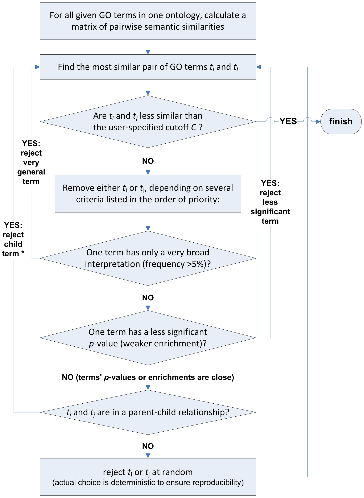

## Repository description

This is the main REVIGO Core library that implements the whole clustering algorithm and visualizations.

## About REVIGO (REduce + VIsualize Gene Ontology) project

Outcomes of high-throughput biological experiments are typically interpreted by statistical testing
for enriched gene functional categories defined by the Gene Ontology (GO). The resulting lists of GO terms 
may be large and highly redundant, and thus difficult to interpret.

REVIGO is a successful project to summarize long, unintelligible lists of Gene Ontology terms by finding a representative subset 
of the terms using a simple clustering algorithm that relies on semantic similarity measures.

## Algorithm to reduce redundancy within lists of GO terms

Researchers analyzing annotations of gene products are often faced with long lists of GO terms 
that are either close in the GO hierarchy (sibling terms) or are related by inheritance (child and parent terms). 
These redundant lists are difficult to interpret, but are likely to contain clusters of semantically similar GO terms.

To mitigate the problem of large and redundant lists, we aim to find a single representative GO term for each of these clusters. 
REVIGO performs a simple clustering procedure which is in concept similar to the hierarchical (agglomerative) clustering methods 
such as the neighbor joining approach.

 
<i>A flowchart of the simplified algorithm to reduce redundancy.</i>

For any further information about REVIGO please see 
[Our paper](http://dx.doi.org/10.1371/journal.pone.0021800){:target="_blank" rel="noopener"}

